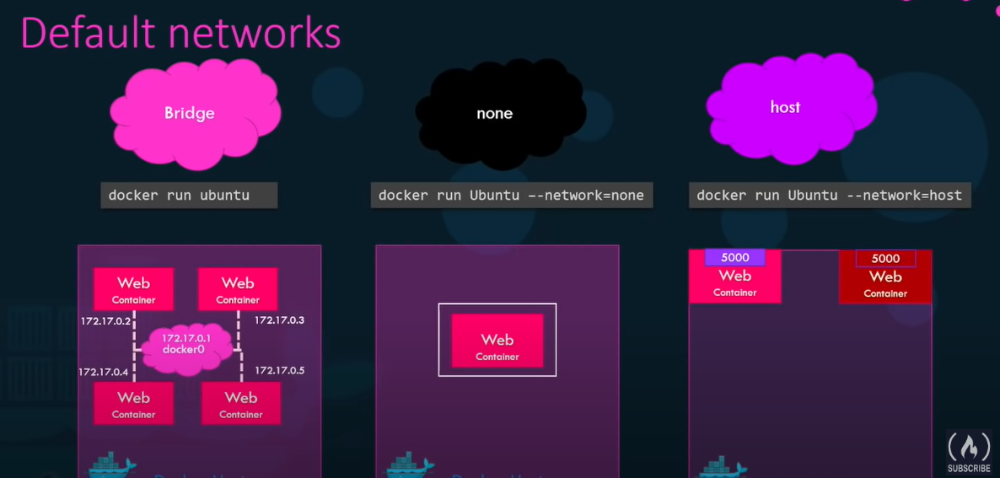

# Docker Commands


for example this command will pull the nginx image if it is not available locally.

```bash
docker run nginx
```

Run the container in detached mode
```bash
docker run -d nginx
```

attach to a detached container
```bash
docker attach silly_semmet
```


lists the currently running containers
```bash
docker ps
```

to list all containers (running or not) add the `-a` flag

```bash
docker ps -a
```

To stop a container run this command using the container name or ID
```bash
docker stop silly_semmet
```

delete a stopped container
```bash
docker rm silly_semmet
```

List all images available locally
```bash
docker images
```

Remove an image that you no longer need
```bash
docker rmi image_name
```

Pull image
```bash
docker pull nginx
```

Run command when starting a container
```bash
docker run ubuntu sleep 10
```

Run container in interactive mode
```bash
docker run -i ubuntu 
```

Run container in interactive mode with pseudo-terminal
```bash
docker run -it ubuntu 
```


Run command on a running container
```bash
docker exec silly_semmet cat ~/.bashrc
```


Port mapping
```bash
docker run -p host_port:container_port image
```

Volume mapping
```bash
docker run -v host_path:container_path image
```

Inspect a container
```bash
docker inspect container_name
```

## Create a docker image

1. Start with an image for an OS

2. Write down steps to deploy your application

3. Create a dockerfile

4. Build the docker image from the dockerfile in the current folder

```bash
docker build . -t image_name
```

5. Push your image to dockerhub (optional)
```bash
docker login

docker push image_name:tag
```

## Dockerfile

* `FROM` is used to specify the base image

* `RUN` used to run a command on the container

* `COPY` copies files from the host machine to the container, when creating the image

* `ENTRYPOINT` Command that should be run when the container starts 

## Docker networks



* Bridge: it is the default, docker containers on the same host can talk to each other but the cannot reach the outside world, nor the outside can reach them, to reach them you have to use port mapping on the host.

* host: The containers join the same network as the host.


## Docker Networking

### Bridge (Default)
