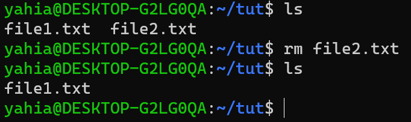
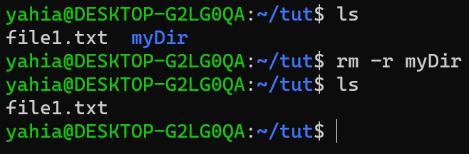
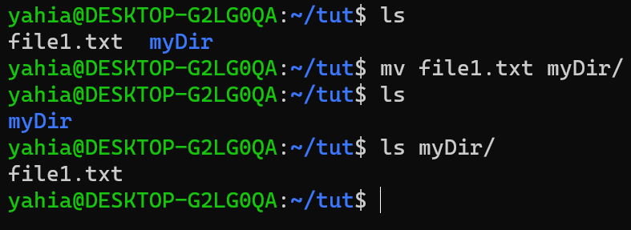
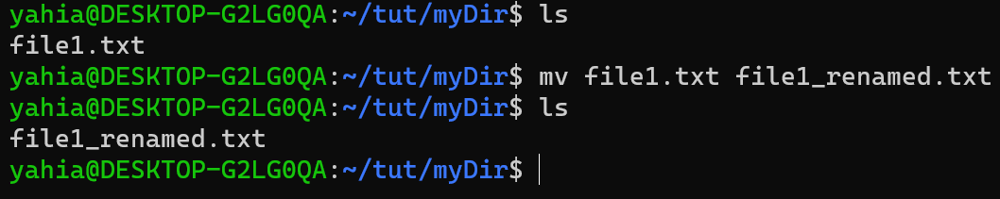
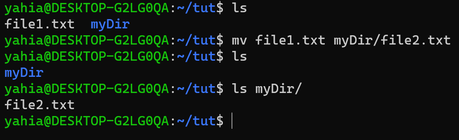
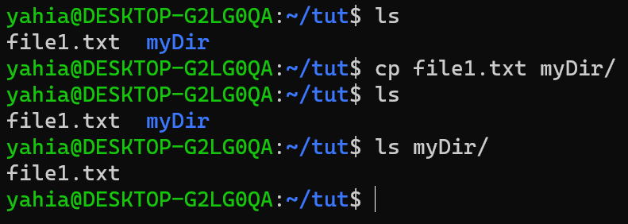
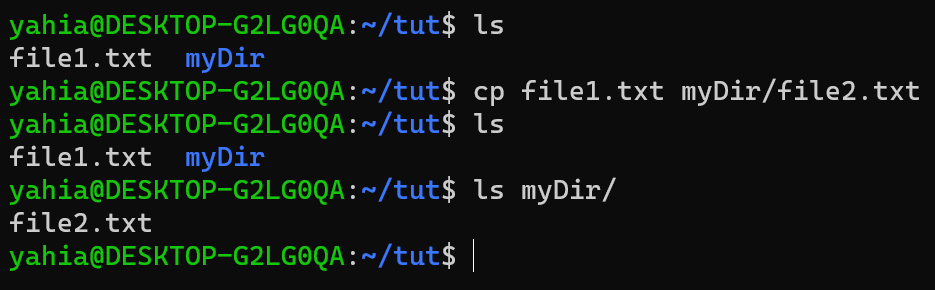
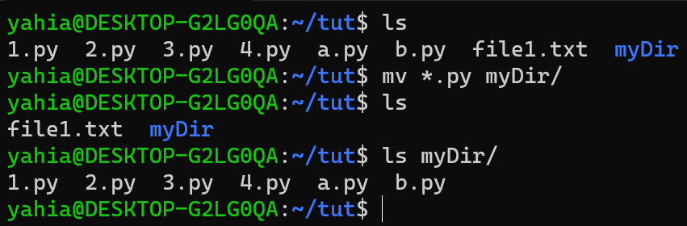

# Welcome to TUX


## What is a Distro


There are many distributions of Linux but for our case we only care about those that are derived from debian (which is still a lot of distros).

You can know that a distro is derived from debian by simply looking at its package manager (we will talk more about package management later), if the distro uses `apt` then it is derived from debian.

## File system tree


## Linux Command Line

### Start the terminal


### List Files

The photo shows the most used flags of the `ls` command but there are many other flags.


### Man

The `man` command is your best friend when you need a quick description of a certain command. `man` stands for "Manual" and it does exactly what you think it does.

Let's say you want to know what other flags can the `ls` command accept, to get that you can type `man ls` to get the full description of the `ls` command.


Use your arrows to navigate the Manual page (optionally you can use the vim keys). And when you are ready to exit press `q` to quit.

Notice that `man` is just another regular command, so if you want more info on `man` you can always use `man man` to read the manual of the `man` command.

### Change Directory


### creating Files

You can create a file by using the `touch` command. This will create an empty file.


### Editing Files

Now that you have created your files you want to edit them. You can do so using a text editor. `nano` is the simplest terminal text editor found on most linux systems.

If I want to edit `file1.txt` for example, I will use the command `nano file1.txt`. Note that if you use the command `nano file2.txt` and `file2.txt` does not exist, nano will create it for you and you can start editing it right away, so if you want to create a file and edit it you don't need to use the `touch` command at all.

### Making Directories

To make a new directory use the `mkdir` command, and it works just like the touch command. So for example if I want to create a directory called "myDir" I would just type `mkdir myDir`

### Removing Files

To remove a file you can use the `rm` command.



To remove a Directory you can use the same command but you have to give it the `-r` flag to make it delete the directory and all the files inside it.



### Moving Files

To move a file from one location to another use the `mv` command.



### Renaming Files

You can also use the `mv` command to rename a file.



### Combine Moving and Renaming

If I want to move a file from one location to another but I want it to have a different name at the new location, I can do this using one command.



### Copying Files

To copy files you can use the `cp` command.



### Combine Copying and Renaming

To copy a file from one location to another but give it a different name at the new location, we use the same trick we used for the `mv` command.



### Wild Card

Imagine that I have 3 files (file1.txt, file2.txt and file3.txt) and I want to delete them. I can do this in three ways

1. Delete them one after the other
    ```bash
    rm file1.txt
    rm file2.txt
    rm file3.txt
    ```
1. Delete them all in the same command by writing their names
    ```bash
    rm file1.txt file2.txt file3.txt
    ```
1. I can tell Linux to delete all files that match the pattern "file(...).txt", this is done using an asterisk "*". So the command becomes like this
    ```bash
    rm file*.txt
    ```

The asterisk is known as the "Wild Card" because any string will match it, so in our previous example if we had a file named "file_A.txt" it will be deleted too, so it is very dangerous to use the wild card carelessly.

Using the wild card is usually acceptable when you want to operate on all files that have the same extension, so for example if I want to delete all txt files from  myDir I would use the following command.
```bash
rm myDir/*.txt
```
The wild card is not just useful for deletion, it can be used with any command such as `mv`. Here I moved all python files to myDir


> AGAIN....DO NOT USE THE WILD CARD CARELESSLY

## Package Management

Package management is just a fancy expression for "app store". In windows you can grab a random exe file from the internet and run it, this way of installing programs is messy and dangerous. So in linux we have a program whose job is to manage your programs, this program is called the package manager. You can use the package manager to install, uninstall and update all your programs.

For debian based distros, the package manager is `apt` which stands for "Advanced Package Tool". One of its main advantages is its easy syntax, to see it let us take vim as an example:

* To install vim
```bash
sudo apt install vim
```

* To remove vim
```bash
sudo apt remove vim
```

You can also use apt to update all your programs. This  is done using two commands.
```bash
sudo apt update
sudo apt upgrade
```
To understand the role of each command we must first understand how apt gets its packages.

Every distro has its own servers and they store their packages on those servers, so when you want to install a new program or update your system, apt fetches the latest versions of the desired programs and installs them locally.

So the first command `apt update` is used to let apt update its database and synch it to the one stored on the servers. And the second command `apt upgrade` is used to actually upgrade the local programs.

Note that `sudo` is just used to give the user admin privileges and has no actual relation to `apt` itself, `sudo` should be used whenever you need to elevate your privileges regardless of the command you are running.

There are other `apt` commands that don't need root privileges but can be useful, for example:

* To search for a program
```bash
apt search vim
```

* To list all the installed packages
```bash
apt list
```

---

> That's pretty much everything you need to know