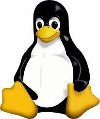

# Welcome to TUX

## File system tree

## Linux Command Line

### Start the terminal

### List Files

The photo shows the most used flags of the `ls` command but there are many other flags.

### Man

The `man` command is your best friend when you need a quick description of a certain command. `man` stands for "Manual" and it does exactly what you think it does.

Let's say you want to know what other flags can the `ls` command accept, to get that you can type `man ls` to get the full description of the `ls` command.

Use your arrows to navigate the Manual page (optionally you can use the vim keys). And when you are ready to exit press `q` to quit.

Notice that `man` is just another regular command, so if you want more info on `man` you can always use `man man` to read the manual of the `man` command.

### Change Directory

