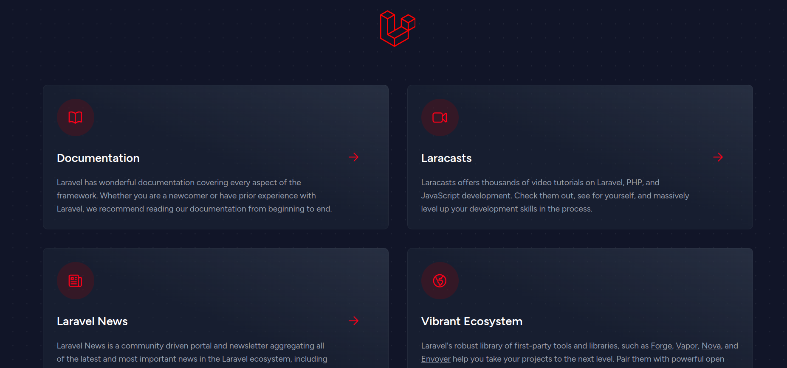

# Server start

This documents the process of starting the server with all of its components.

I will be assuming that you have access to a machine that is set up to be a server (has the Dashboard installed with all of its accompanying components). I will also assume that you have access to the pi. The pi already has the components needed for its operation installed.

## Server side

The server is only responsible for running the GUI of the dashboard, the backend component and ROS both run on the pi and will be discussed later.

To run the GUI follow these steps

1. cd ~/Dashboard
1.
1.2. edit the .env file to contain the IP address of the pi
1.
1.3. npm start


wait a little for npm to start the application, if you see the phrase "No issues found" then you're all good.

To make sure that the application has started correctly and is accessible accross the network, try accessing the dashboard from any device by typing this into the url of your browser

```
your_server_IP:3000
```

If your browser cannot access the dashboard this is probably due to the firewall running on the server, you can stop it using

```bash
sudo systemctl stop ufw
```

This will stop the firewall for now but it will start again the next time you restart the server, if you want to stop it for good run

```bash
sudo systemctl disable ufw
```

## Pi side

The pi has two components

* Backend of webapp

* Ros component

### Web Backend

To run the web backend use the following command in the ~/GP_laravel directory

```bash
php artisan serve --host=your_pi_IP
```

To make sure your bakend server is running go to your browser and enter this in the url bar

```
your_pi_IP:8000
```

you should see a page similar to this



If your browser cannot access the page but the pi shows no errors it is likely the same firewall issue and you can solve it the same way you did with the dashboard.

### ROS Component

There are two cases to run ros

1. You want to run roscore just to test something on the web app

2. You want to launch the full ros stack with all the nodes and odomotry publishers, subscribers, etc...

But before we discuss the details of each usecase, you must edit a very important file. On the pi you should find a file in your home directory called `.rosconfig`, before doing anything with ros edit this file to reflect the correct IP addresses.

#### Running only roscore

This is the simplist usecase, simply source the `~/.rosconfig` file and run `roscore`, then run any node or ros commands you want but make sure to source the `~/.rosconfig` in all terminals.

#### Running the entire ROS stack
After sourcing the `~/.rosconfig` execute the following commands

```bash
torta_build
```
this will source the needed files and rebuild ros scripts (it runs catkin_make)

then run
```bash
roslaunch torta-bringup robot_low_level_w_odom.launch
```

Now the ros stack is ready you can then run your own ros nodes or publish ros messages from the terminal or the webapp.
